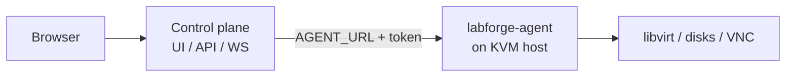

# LabForge

KVM lab provisioner: cloud-init VMs, browser consoles, and a host resource budget.

**Control plane** (UI and API) talks to **labforge-agent** on the KVM host.
One codebase, two roles. No controller RPM.



## Pick a path

| If you want... | Do this |
|--------------|---------|
| Try it on one machine | [Install](docs/install.md) (`./deploy/install-local.sh`) |
| Control in Kubernetes, VMs on a hypervisor | [Deploy](docs/deploy.md) (Helm + agent package) |
| Understand the pieces | [Architecture](docs/architecture.md) |

## Quick start (single host)

```bash
git clone <your-fork> labforge
cd labforge
./deploy/install-local.sh    # or: make install
```

Open http://127.0.0.1:8899, add a template (`./scripts/fetch-templates.sh`), provision.

## Docs

| Doc | When you need it |
|-----|------------------|
| [Architecture](docs/architecture.md) | How control and agent fit together |
| [Install](docs/install.md) | Local systemd setup |
| [Deploy](docs/deploy.md) | Helm, Kustomize, packages, container |
| [Templates](docs/templates.md) | Cloud images, uploads, naming |
| [Configuration](docs/configuration.md) | Environment variables |
| [Operations](docs/operations.md) | Credentials, Tailscale, capacity, metrics |
| [API](docs/api.md) | REST and WebSocket |
| [Security](docs/security.md) | Trust boundary |
| [Development](docs/development.md) | Tests, versioning, CI |
| [CentOS Stream 10 template](docs/template-setup.md) | Distro-specific image setup |

## License

MIT. Vendored: noVNC 1.7.0 (MPL-2.0) in `backend/app/static/novnc/`,
xterm.js (MIT) in `backend/app/static/xterm/`.
