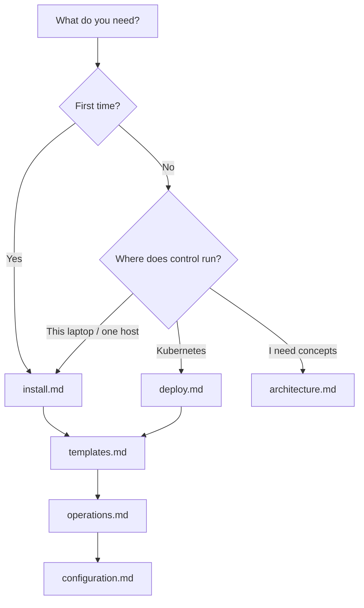

# Docs

Start at the [root README](../README.md), then open the page that matches your task.

| Doc | Contents |
|-----|----------|
| [Architecture](architecture.md) | Control plane vs agent |
| [Install](install.md) | Single-host local install |
| [Deploy](deploy.md) | Helm, Kustomize, packages, container |
| [Templates](templates.md) | Cloud images and qcow2 uploads |
| [Configuration](configuration.md) | Environment variables |
| [Operations](operations.md) | Credentials, Tailscale, capacity, metrics |
| [API](api.md) | REST and WebSocket |
| [Security](security.md) | Exposure and credentials |
| [Development](development.md) | Tests, releases, CI |
| [CentOS Stream 10](template-setup.md) | Distro template setup |
