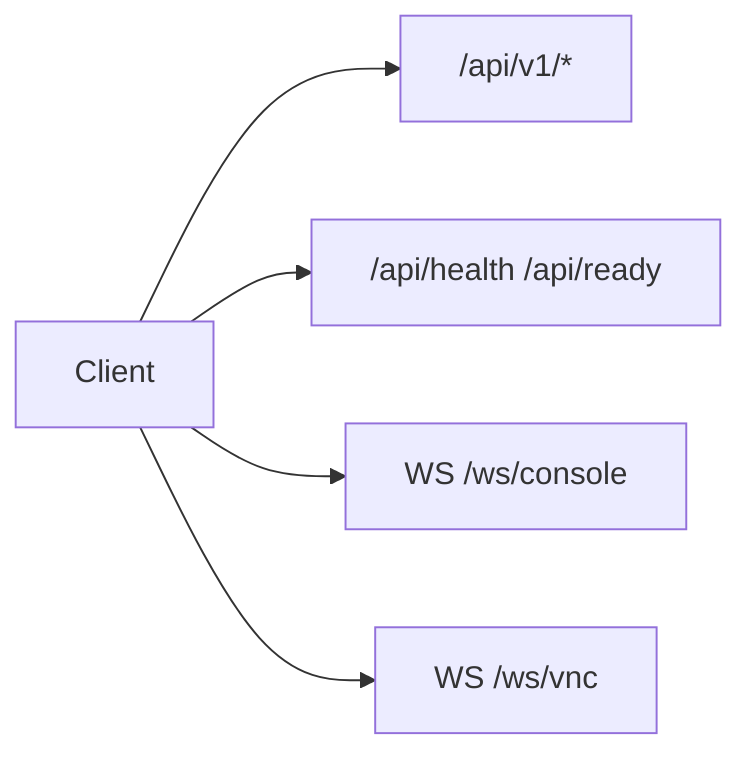

# API

Interactive docs while the app is running: `/api/docs`, `/api/redoc`.



```
GET    /api/v1/vms
GET    /api/v1/vms/{name}
GET    /api/v1/vms/{name}/usage
POST   /api/v1/vms
POST   /api/v1/vms/{name}/start|stop|reboot
POST   /api/v1/vms/{name}/reset
DELETE /api/v1/vms/{name}
GET    /api/v1/templates
GET    /api/v1/images
POST   /api/v1/images                 # multipart field "file"
DELETE /api/v1/images/{name}
GET    /api/v1/vms/{name}/snapshots
POST   /api/v1/vms/{name}/snapshots
POST   /api/v1/vms/{name}/snapshots/{s}/revert
DELETE /api/v1/vms/{name}/snapshots/{s}
GET    /api/v1/host/usage
GET    /api/v1/host/capacity
GET    /api/v1/host/check
GET    /api/health
GET    /api/ready
WS     /ws/console/{name}
WS     /ws/vnc/{name}
```

## Provision body

Exactly one of `template` or `image`:

```json
{
  "name": "demo",
  "template": "fedora-44",
  "memory_mb": 1536,
  "vcpus": 2,
  "disk_gb": 30,
  "vm_user": "lab",
  "vm_password": "choose-a-password",
  "enable_tailscale": true
}
```

```json
{ "name": "demo", "image": "ubuntu-24.04.qcow2", "enable_tailscale": true }
```
