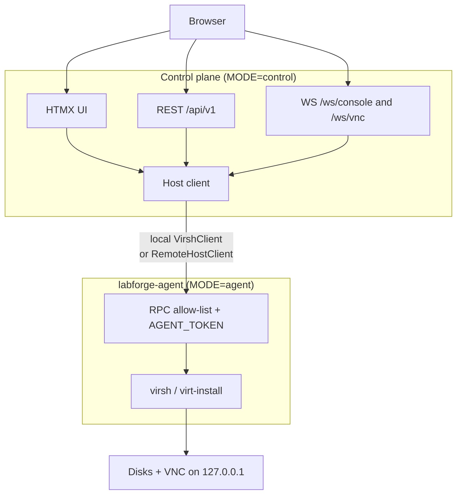
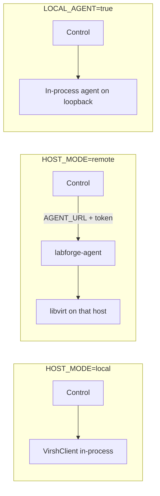

# Architecture

LabForge is two roles in one codebase.

| Mode | What it does | Default port |
|------|--------------|--------------|
| `MODE=control` | UI, API, WebSocket proxy | 8899 (systemd) / 8000 (container) |
| `MODE=agent` | Owns libvirt on a KVM host | 8443 |

## How control reaches libvirt

| Setting | Behavior |
|---------|----------|
| `HOST_MODE=local` | In-process `VirshClient` (single host) |
| `HOST_MODE=remote` | One `AGENT_URL` + `AGENT_TOKEN` (one hypervisor) |
| `LOCAL_AGENT=true` | Control starts an in-process agent on loopback |

Kubernetes and Helm deploy **control only** (`HOST_MODE=remote`). Libvirt always
stays behind the `labforge-agent` package. One `AGENT_URL` is one host, not a fleet.

## Agent auth

- Bearer `AGENT_TOKEN` required unless `AGENT_ALLOW_ANONYMOUS=true` (dev only).
- `GET /agent/v1/health` stays open for probes.
- Only methods in `host_client.RPC_METHODS` are callable.

For a remote control plane, set `AGENT_BIND` on the agent to an address the
control plane can reach (not `127.0.0.1`).
