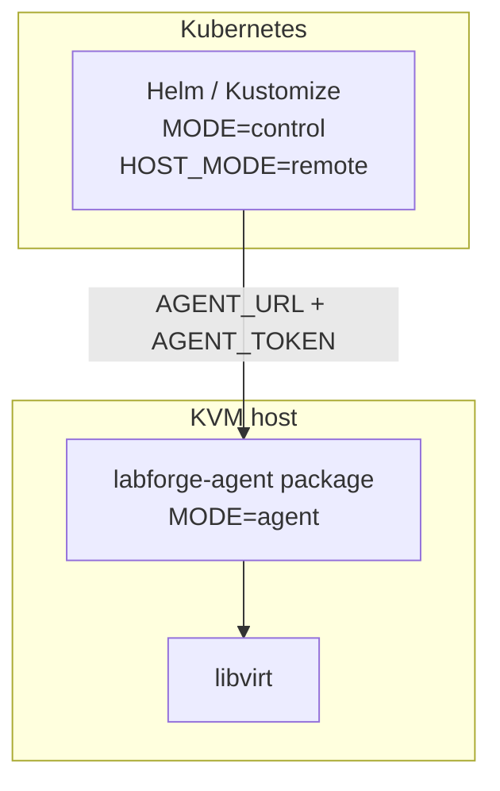

# Deploy

| Piece | Artifact |
|-------|----------|
| Control plane | `ghcr.io/shatadru/labforge:1.0.0`, Helm, Kustomize, or `install-local.sh` |
| Agent | `labforge-agent` `v1.0.0` `.deb` / `.rpm` |

Helm and Kustomize defaults can differ. Check the values you apply.



## 1. Install the agent on the hypervisor

```bash
VERSION=1.0.0
curl -fLO "https://github.com/shatadru/labforge/releases/download/v${VERSION}/labforge-agent_${VERSION}_amd64.deb"
sudo apt install "./labforge-agent_${VERSION}_amd64.deb"
# Fedora/RHEL/CentOS: download labforge-agent-${VERSION}-1.x86_64.rpm instead,
# then run: sudo dnf install ./labforge-agent-${VERSION}-1.x86_64.rpm
```

Release assets: <https://github.com/shatadru/labforge/releases/latest>.

Edit `/etc/labforge/labforge-agent.env`:

- Set `AGENT_TOKEN` (`openssl rand -hex 32`)
- For a remote control plane, set `AGENT_BIND` to a reachable address (not loopback)

```bash
sudo systemctl enable --now labforge-agent
```

## 2a. Helm (control only)

```bash
kubectl create namespace labforge
kubectl -n labforge create secret generic labforge-ssh-keys \
  --from-file=authorized_keys=$HOME/.ssh/id_ed25519.pub
kubectl -n labforge create secret generic labforge-agent-token \
  --from-literal=token="$(openssl rand -hex 32)"
helm install labforge charts/labforge \
  --namespace labforge \
  --set image.repository=ghcr.io/shatadru/labforge \
  --set image.tag=1.0.0 \
  --set agent.url=http://kvm-host:8443 \
  --set agent.tokenSecretName=labforge-agent-token \
  --set sshKeys.secretName=labforge-ssh-keys
```

Use the **same** token on the agent. Full options: `charts/labforge/values.yaml`.

The chart is also published as an OCI artifact on GHCR (one version per
release, alongside the image and packages):

```bash
helm install labforge oci://ghcr.io/shatadru/charts/labforge \
  --version 1.0.0 --namespace labforge -f my-values.yaml
```

## 2b. Kustomize

```bash
kubectl create namespace labforge
kubectl -n labforge create secret generic labforge-ssh-keys \
  --from-file=authorized_keys=$HOME/.ssh/id_ed25519.pub
kubectl -n labforge create secret generic labforge-agent-token \
  --from-literal=token="$(openssl rand -hex 32)"
kubectl apply -k k8s/overlays/dev
```

Set `AGENT_URL` in `k8s/base/configmap.yaml` (or patch). Pin the image to a
released tag such as `ghcr.io/shatadru/labforge:1.0.0` rather than `latest`.

## Container (control only)

```bash
docker pull ghcr.io/shatadru/labforge:1.0.0
docker run --rm -p 8000:8000 \
  -e MODE=control \
  -e HOST_MODE=remote \
  -e AGENT_URL=http://kvm-host:8443 \
  -e AGENT_TOKEN="$(cat /path/to/agent-token)" \
  -e SSH_PUBLIC_KEYS_FILE=/etc/labforge/ssh/authorized_keys \
  -v "$HOME/.ssh/labforge_authorized_keys:/etc/labforge/ssh/authorized_keys:ro" \
  ghcr.io/shatadru/labforge:1.0.0
```

## Browser access (Tailscale Ingress)

Set `ingress.enabled=true` and `global.labforge.ingressHost` to the MagicDNS
name; the Tailscale Operator provisions the hostname and HTTPS certificate.
The control plane still reaches each KVM host through the agent URL and bearer
token.

## Login and chat (bundled)

One install can bring up the whole stack alongside LabForge:

| Component | Role | Endpoint |
|---|---|---|
| oauth2-proxy | Login gate in front of LabForge | `ingressHost/oauth2/*` |
| Pocket ID (optional) | Self-hosted OIDC provider (passkeys), offline mode | its own issuer hostname |
| ntfy (optional) | One persistent chat room | none (ClusterIP only) |

### GitHub (default)

Create a GitHub OAuth App (callback `https://<ingressHost>/oauth2/callback`,
scopes `read:org` and `user:email`), a credentials Secret, and the username
allowlist ConfigMap:

```bash
kubectl -n labforge create secret generic labforge-github-oauth \
  --from-literal=client-id=... \
  --from-literal=client-secret=... \
  --from-literal=cookie-secret="$(openssl rand -hex 16)"

# Comma-separated GitHub usernames. Kept in the cluster, not in chart values.
kubectl -n labforge create configmap labforge-github-users \
  --from-literal=users="alice,bob"

helm install labforge charts/labforge --namespace labforge \
  --set agent.url=http://kvm-host:8443 \
  --set auth.enabled=true \
  --set chat.enabled=true \
  --set ingress.enabled=true \
  --set global.labforge.ingressHost=labforge.example.com
```

The provider reads the allowlist at runtime from the ConfigMap named by
`global.labforge.github.usersConfigMap` (key `global.labforge.github.usersKey`,
default `users`), so the usernames are data in the cluster rather than chart
values. Access can also be scoped with `global.labforge.github.org` and/or
`.team`. The chart refuses to render when there is no restriction at all; set
`global.labforge.github.allowAll=true` only for a deliberately open setup.

### Pocket ID (offline / self-contained)

Use the overlay to run a bundled OIDC provider (passkeys) instead of GitHub:

```bash
kubectl -n labforge create secret generic labforge-auth \
  --from-literal=ENCRYPTION_KEY="$(openssl rand -base64 32)" \
  --from-literal=STATIC_API_KEY="$(openssl rand -hex 32)" \
  --from-literal=cookie-secret="$(openssl rand -hex 16)"

helm install labforge charts/labforge --namespace labforge \
  -f charts/labforge/values-pocket-id.yaml \
  --set agent.url=http://kvm-host:8443 \
  --set auth.enabled=true \
  --set ingress.enabled=true \
  --set global.labforge.ingressHost=labforge.example.com \
  --set global.labforge.issuer=https://pocket-id.example.com \
  --set pocket-id.host=pocket-id.example.com
```

The bootstrap job creates the OIDC client and writes `client-id`/`client-secret`
into the Secret. Register the first user in Pocket ID (it becomes admin), then
close open signups. `allowUserSignups` only takes effect with
`pocket-id.config.ui.useDefaults=false`:

```bash
helm upgrade labforge charts/labforge --namespace labforge --reuse-values \
  -f charts/labforge/values-pocket-id.yaml \
  --set pocket-id.config.ui.useDefaults=false \
  --set pocket-id.config.ui.settings.app.allowUserSignups=disabled
```

See `charts/labforge/values.yaml` for the full surface (resources, storage
classes, topic name).

## Single-host systemd

Same machine for UI and libvirt: [Install](install.md) (`LOCAL_AGENT=true`).
