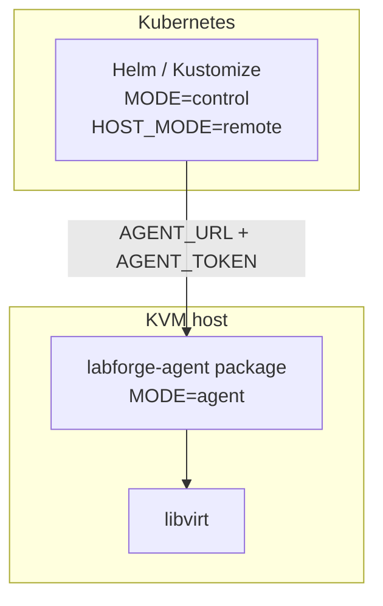

# Deploy

| Piece | Artifact |
|-------|----------|
| Control plane | Container image, Helm, Kustomize, or `install-local.sh` |
| Agent | `labforge-agent` `.deb` / `.rpm` only |

Helm and Kustomize defaults can differ. Check the values you apply.



## 1. Install the agent on the hypervisor

```bash
make package
sudo dpkg -i dist/labforge-agent_*.deb   # or: sudo rpm -i dist/labforge-agent-*.rpm
```

Edit `/etc/labforge/labforge-agent.env`:

- Set `AGENT_TOKEN` (`openssl rand -hex 32`)
- For a remote control plane, set `AGENT_BIND` to a reachable address (not loopback)

```bash
sudo systemctl enable --now labforge-agent
```

## 2a. Helm (control only)

```bash
kubectl create namespace labforge
kubectl -n labforge create secret generic labforge-ssh-keys \
  --from-file=authorized_keys=$HOME/.ssh/id_ed25519.pub
kubectl -n labforge create secret generic labforge-agent-token \
  --from-literal=token="$(openssl rand -hex 32)"
helm install labforge charts/labforge \
  --namespace labforge \
  --set image.repository=ghcr.io/OWNER/labforge \
  --set image.tag=0.1.0 \
  --set agent.url=http://kvm-host:8443 \
  --set agent.tokenSecretName=labforge-agent-token \
  --set sshKeys.secretName=labforge-ssh-keys
```

Use the **same** token on the agent. Full options: `charts/labforge/values.yaml`.

## 2b. Kustomize

```bash
kubectl create namespace labforge
kubectl -n labforge create secret generic labforge-ssh-keys \
  --from-file=authorized_keys=$HOME/.ssh/id_ed25519.pub
kubectl -n labforge create secret generic labforge-agent-token \
  --from-literal=token="$(openssl rand -hex 32)"
kubectl apply -k k8s/overlays/dev
```

Set `AGENT_URL` in `k8s/base/configmap.yaml` (or patch). Replace
`ghcr.io/OWNER/labforge` with your image.

## Container (control only)

```bash
docker build -t labforge:0.1.0 backend
docker run --rm -p 8000:8000 \
  -e MODE=control \
  -e HOST_MODE=remote \
  -e AGENT_URL=http://kvm-host:8443 \
  -e AGENT_TOKEN="$(cat /path/to/agent-token)" \
  -e SSH_PUBLIC_KEYS_FILE=/etc/labforge/ssh/authorized_keys \
  -v "$HOME/.ssh/labforge_authorized_keys:/etc/labforge/ssh/authorized_keys:ro" \
  labforge:0.1.0
```

## Single-host systemd

Same machine for UI and libvirt: [Install](install.md) (`LOCAL_AGENT=true`).
