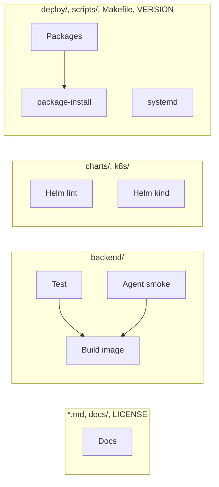

# Development

## Tests

```bash
cd backend
pip install -r requirements-dev.txt
pytest
pytest --cov=app --cov-fail-under=80
tox          # optional local isolated env
```

Jinja templates use strict undefined in tests.

## Versioning

Single source: top-level `VERSION`, bumped by `bump-my-version`
(`.bumpversion.toml`), which also rewrites `charts/labforge/Chart.yaml`
(`version` and `appVersion`) in the same commit. `scripts/version.sh` resolves
the version for packages, charts and images:

| Context | Version |
|---------|---------|
| Tag `vX.Y.Z` | `X.Y.Z` |
| CI on a branch | `X.Y.Z-ci.<short-sha>` |
| Local, no exact tag | `X.Y.Z-dev` |

```bash
make release-minor   # also release-patch, release-major
git push             # then create a GitHub Release for the new tag
```

## Releasing

Releases are driven by GitHub Releases (`.github/workflows/release.yml`), not
by raw tags. Publishing a release fans one tag out to every artifact: the
container image, the agent `.deb`/`.rpm`, the Helm chart `.tgz`, and the chart
pushed to GHCR as OCI.

Either path works:

1. **From the UI.** `make release-minor` (or patch/major), `git push`, then
   GitHub -> Releases -> Draft a new release on tag `vX.Y.Z` -> Publish.
2. **Fully in CI.** Actions -> *Release* -> Run workflow -> choose
   `patch`/`minor`/`major`. The bot bumps, pushes to `main`, and opens a draft
   release; you review and click **Publish**.

The publisher verifies the release tag equals `VERSION` and
`Chart.yaml` before building anything, so a mismatched tag fails fast.

## CI

`.github/workflows/ci.yml` on PR and push to `main`. Jobs run only when their
paths change. Tag `v*` runs everything.



| Paths | Jobs |
|-------|------|
| `*.md`, `docs/**`, `LICENSE` | Docs |
| `backend/**` | Test, Agent smoke, Build image, Packages |
| `charts/**`, `k8s/**` | Helm lint, Helm kind |
| `deploy/**`, `scripts/**`, `Makefile`, `VERSION` | Packages, package-install, systemd |
| `.github/workflows/**` | All jobs |
| GitHub Release `v*` | `release.yml` (publish image, packages, chart) |

A docs-only PR should run **Detect changed paths** and **Docs** only.
Changing the workflow file itself retriggers the full set (this PR does that).
