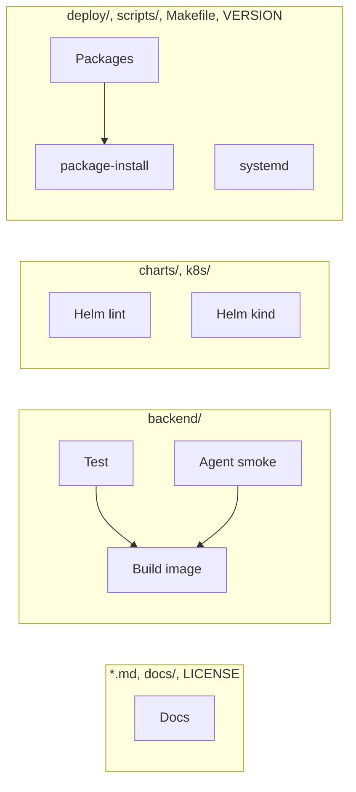

# Development

## Tests

```bash
cd backend
pip install -r requirements-dev.txt
pytest
pytest --cov=app --cov-fail-under=80
tox          # optional local isolated env
```

Jinja templates use strict undefined in tests.

## Versioning

Single source: top-level `VERSION`, resolved by `scripts/version.sh`:

| Context | Version |
|---------|---------|
| Tag `vX.Y.Z` | `X.Y.Z` |
| CI on a branch | `X.Y.Z-ci.<short-sha>` |
| Local, no exact tag | `X.Y.Z-dev` |

```bash
make bump-minor   # also bump-patch, bump-major
git commit -am "release 0.2.0"
git tag v0.2.0 && git push --follow-tags
```

## CI

`.github/workflows/ci.yml` on PR and push to `main`. Jobs run only when their
paths change. Tag `v*` runs everything.



| Paths | Jobs |
|-------|------|
| `*.md`, `docs/**`, `LICENSE` | Docs |
| `backend/**` | Test, Agent smoke, Build image, Packages |
| `charts/**`, `k8s/**` | Helm lint, Helm kind |
| `deploy/**`, `scripts/**`, `Makefile`, `VERSION` | Packages, package-install, systemd |
| `.github/workflows/**` | All jobs |
| Git tag `v*` | All jobs |

A docs-only PR should run **Detect changed paths** and **Docs** only.
Changing the workflow file itself retriggers the full set (this PR does that).
