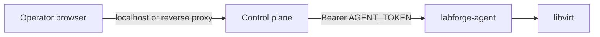

# Security

- No built-in authentication on the control plane by default. Bind to
  localhost or put an authenticating reverse proxy in front. The Helm chart can
  bundle Pocket ID + oauth2-proxy (`auth.enabled=true`) so the browser edge is
  login-protected and oauth2-proxy forwards `X-Forwarded-User` to the app.
  Optional `API_KEY` locks `/api/v1`.
- WebSockets reject cross-origin connections. VNC bridge dials loopback only;
  `GRAPHICS_LISTEN` must be loopback.
- Guest password (if any) is only in the seed ISO (`0640`), not in app config.
  Login user is in the libvirt domain description.
- Agent: bearer token (or explicit anonymous for local dev). RPC allow-list.
- `VM_NAME_PREFIX` is a namespace, not an authorization boundary.
