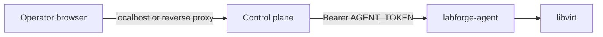

# Security

- No built-in authentication on the control plane by default. Bind to
  localhost or put an authenticating reverse proxy in front. The Helm chart can
  run oauth2-proxy in front (`auth.enabled=true`), defaulting to GitHub (limit
  access with a username allowlist ConfigMap, `global.labforge.github.org`
  and/or `.team`) or a bundled Pocket ID OIDC provider
  (`-f charts/labforge/values-pocket-id.yaml`). oauth2-proxy forwards
  `X-Forwarded-User` to the app, which the UI shows next to a log out link.
  Optional `API_KEY` locks `/api/v1`.
- WebSockets reject cross-origin connections. VNC bridge dials loopback only;
  `GRAPHICS_LISTEN` must be loopback.
- Guest password (if any) is only in the seed ISO (`0640`), not in app config.
  Login user is in the libvirt domain description.
- Agent: bearer token (or explicit anonymous for local dev). RPC allow-list.
- `VM_NAME_PREFIX` is a namespace, not an authorization boundary.
