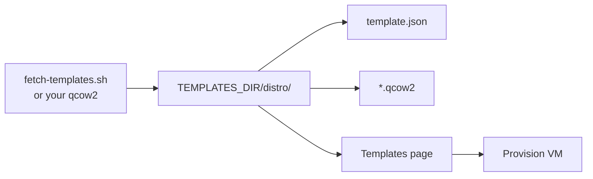

# Templates

A template is a directory under `TEMPLATES_DIR`: cloud image plus optional
`template.json`.

The agent package intentionally does not bundle the multi-hundred-megabyte
guest images. Download or copy the images onto each KVM host. The supported
release templates are Fedora 44, Debian 12, RHEL 10, CentOS Stream 10, and
Ubuntu 24.04; each directory needs its image and optional `template.json`.



Layout:

```
$TEMPLATES_DIR/
  default/                 # shared cloud-init Jinja2
    user-data.j2
    meta-data.j2
    network-config.j2
  fedora-44/
    Fedora-Cloud-Base-xxx.qcow2
    template.json
```

`template.json` (all fields optional):

```json
{
  "description": "Fedora 44 Generic Cloud",
  "memory_mb": 1536,
  "vcpus": 2,
  "disk_gb": 30,
  "os_variant": "fedora44",
  "ssh_user": "cloud-user"
}
```

Image extensions: `.qcow2`, `.img`, `.qcow`, `.raw`. A per-template
`user-data.j2` overrides `default/`.

```bash
./scripts/fetch-templates.sh    # Ubuntu + Debian, checksum verified
```

Distro-specific walkthrough: [CentOS Stream 10](template-setup.md).

## Provision from an uploaded qcow2

On **Templates** → **Provision from qcow2**:

1. Pick a file, drag and drop, or choose something already in `IMPORT_DIR`
2. LabForge validates it as qcow2 and selects it
3. Set name, size, and credentials as usual

`IMPORT_DIR` defaults to `<VM_STORAGE_PATH>/imports`. Cap: `MAX_UPLOAD_GB`
(default 64). The upload is never modified; LabForge copies and resizes a VM disk.

## VM naming

Pattern: `<prefix><template>-<name>` (example: `labs-fedora-44-web1`).

- Uploaded images use the file stem (dots become hyphens)
- Names are lowercased; separators collapse; max 63 characters
- Must stay under `VM_NAME_PREFIX` so LabForge never touches other VMs
